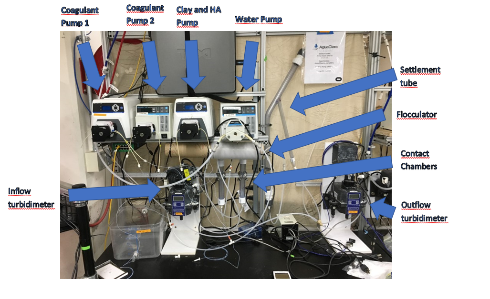

# 2 Stage Coagulant Addition, Spring 2018
#### Barbara Oramah, Ching Pang, Yuhao Du
#### April 14, 2018

<div class="alert alert-block alert-danger">
Why is the title not capitalized?
</div>

<div class="alert alert-block alert-danger">
Please do not delete my comments. Address them in the report and I will check them on the next submission. If you disagree with any of the comments, add your own comment under mine.
</div>

## Abstract

<div class="alert alert-block alert-danger">
Use full, complete sentences.

The ideas in the final sentece are key to your work this semester and is understandable.

Combine these four sections into one paragraph. An abstract needs to be cohesive and short/clear/concise. Keep it under 100 words. See the abstract description in the rubric.

</div>


**Up-to-date abstract:** In the past, AguaClara built a predictive model by studying the effect of humic acid, clay and PAC coagulant on flocculation. Based on the modelling result and the study of bonding mechanism, it was hypothesized that two-stage coagulant addition, namely a separate coagulant addition, would increase the particle removal efficiency  while maintaining the coagulant dosage. During the first stage, coagulant was added to offset the effect of humic acid in water, then the second stream of coagulant can aggregate clay. The nano-aggregate formed in the first stage and small particles join to form big flocs. Last semester, our group designed and fabricated the experimental apparatus. This semester, using the same apparatus, our group conducted experiment for both one stage and two stage coagulant addition to. Our group will keep generating experimental data to compare the efficiency of different coagulant addition method and try to close the debate of one stage versus two stage.

**Apr 2 updated abstract:**
Based on the modelling result and bonding mechanism of humic acid, clay and PAC coagulant, we hypothesized that two-stage coagulant addition, namely a separate coagulant addition, would increase the particle removal efficiency. The first addition of coagulant offset the effect of humic acid in water while the second stream of coagulant aggregated clay. Using the same apparatus fabricated from last semester, we conducted experiment for both one- and two-stage coagulant addition. By comparing the particle removal efficiency of different coagulant addition methods, we aim to close the debate of one stage versus two stage.


## Introduction
**the logic**: ~~first give the background of NOM effect on flocculation and point out the problem: NOM reduce flocculation efficiency. then explain why we want to study its effect-want to optimize operation condition. then discuss what we learned in the past research-mainly the model and its result. then develop the hypothesis-two stage can save coagulant. after that our experiment test the particle removal efficiency of both 1stage and 2stage addition. so that we can validate our hypothesis: whether 2stage is more efficient. then out line, in the following report we would break down our experiment, from theoretical basis to apparatus design, then experiment process, finally we would analyze the data we generate and offer some conclusion.~~

Flocculation is among the most applied processes for water and wastewater treatment. Therefore, a thorough understanding of the physical and chemical process in flocculation is critical to the optimization of water treatment process, and so a predictive model to describe the flocculation process is needed.**/(basic definition)** However, the model built in the past research of AguaClara only considered the presence of clay and coagulant in water, and failed to take natural organic matters (NOM) into consideration. Natural organic matters, NOMs, are matters composed of organic compounds from the remains and waste products of organisms such as plants and animals and are ubiquitous in the natural water system. NOMs can be generated within the water source through biological activities, or introduced to the water body via drainage within watersheds, including substances generated during the breakdown of terrestrial organisms (Hudson et al., 2007). The application of flocculation to remove NOM from drinking water supplies is efficient, and helps avoiding the formation of disinfection by products (DBPs).[2](Mika et al.,2018) For processes based on the use of chemicals (e.g. coagulation and oxidation) and materials (e.g. adsorption), the increasing concentrations of NOM require the use of more chemicals or materials (Xu et al., 2016a), which ultimately leads to the generation of more sludge or spent materials. Hence, the effect of NOM on flocculation is crucial in developing flocculation processes that optimize the operating conditions, including the amount of coagulants.**/(general incentives and problem of our research)**

In the past research, the original model that only takes coagulant and clay into account has been extended by considering the effect of NOM on flocculation. After studying the bonding mechanism between clay, humic acid (HA), and coagulant, it was found that smaller particles(e.g. humic acid, HA) move faster in the fluid than larger particles(e.g. clay). Thus, in synthetic water composed by clay, HA and coagulant, HA collides and attaches to coagulant before clay. Once the coagulant surface is occupied by HA, the coagulant performance decreases because the occupied surface cannot attach to clay or nano-aggregate. It was assumed less coagulant is needed when it is added separately, a so-called two-stage coagulant addition, meaning the coagulants are added at two different stages of the treatment process.**/(state our hypothesis)** During the first stage, the coagulant is added to offset the effect of humic acid in water; then in the second stage, the second stream of the remaining coagulant can aggregate clay, which joins the nano-aggregate formed in the first stage, and small particles to form big flocs. It was assumed that after the first stage, all coagulant would be coated by humic acid. Thus, the coagulant added in second stage can function simply as an agglomerant to achieve better performance in aggregation.**/(explain our hypothesis)** Furthermore, if the coagulant dosage can be guided by a predictive model, operating conditions of flocculation process can be optimized and coagulant can be used more efficiently. Since AguaClara is an engineering project team focuses on sustainable drinking water supply in developing region, cost is a main concern. Therefore, using less amount of total coagulants in a two-stage settings is beneficial that it reduces the operational cost of water treatment plants.**/(prospective contribution to AC team)**

In this report, findings in literature review and our group's previous work are discussed, and following that are the experiment design and apparatus set-up of our team in this semester. Findings and conclusion based on our experiment data and analysis are described at the end of the main body. Details in experimental operation such as ProCoDA setting, chemical dosage calculation, experiment process can be found after the main text.

<div class="alert alert-block alert-danger">
Good content detailing the importance, but issues with technical writing.Good connection back to importance on cost and resource availability and description of why 2 stage coagulant addition may work.The overall description of the project would be confusing to anyone who hasn't heard about it before. Keep in mind your audience is a new member on the team. So think what did you need to know to understand this and then include that info.
</div>

## Literature Review and Previous Work
**logic**: ~~describe previous work first. in this part, talk about Yingda Du's thesis and our report after that. then is the lit review, lit review should be organized in the following fashion:1.why we do this 2. what did other researcher do 3.~~

### Previous Work of AguaClara Project Team
The research of Yingda Du, a previous graduate student on the project team, explored the effects of NOM on flocculation. Her thesis (Du, 2017) determined the effects of humic acid on the particle size distribution of flocs and settled effluent turbidity for a synthetic surface water treated with polyaluminum chloride (PACl) as coagulant. The results from this thesis showed that presence of NOM increased the concentration of flocs and shifted the particle size distribution toward smaller particle sizes with a concurrent increase in the effluent turbidity. A mechanistically based hydraulic flocculation model, which took effects of humic acids into account, was developed in this research based on the observations of residual turbidity. The model was validated by successfully predicting data from independent experiments. The predictive model provided a useful guideline for effective coagulant dosages in water treatment.

Our research was based on her study of bonding mechanism between different particles in water. There are three different kinds of particle in our research model, they are clay, humic acid and coagulant nanoparticle. As it was shown in Figure 2, there are six kind of possible collision. However, only collisions with coagulant invoved can occur in reality, because clay and humic acid are not sticky, they can not attach to each other or themselves.

   Figure 1： Collisions between particles during flocculation

### Previous Work of Two-Stage Coagulant Addition Subteam
In Fall 2017 semester, TSCA (two-stage coagulant addition) subteam built the theoretical basis for future work by studying research report of previous particle removal research teams in AguaClara and relevant literature online. TSCA subteam built their apparatus based on the design of Contact Chamber subteam. Compared with the previous group*  , the set-up includes five pumps to achieve a precise control on fluid flow rate. Two down-flow contact chambers were applied in series before fluid enters the flocculator. The contact chambers created a space for particle collision to take place. The apparatus set-up of Spring 2018 semester was based on the previous design and the detail will be explained in depth in later chapters.

Studying the operation of ProCoDA software was another critical task the subteam accomplished in Fall 2017 semester. ProCoDA, a process control software software, allows the user to control many parts of the experimental apparatus and to automate data collection. Specifically, ProCoDA can control the speed of peristaltic pumps, regulate flow through solenoid valves, and measure water quality parameters such as turbidity by connecting to the turbidity meter. Automated data acquisition can record the speed of pump, turbidity of water, mass of container to an Excel spreadsheet directly. The resulting data was analyzed with Excel and Python codes. Using the increment function built in ProCoDA enable the team to conduct series of control experiments without staying in the lab. More detail of our experiment will be discussed in Method section of our report.**/(processing)** The original MathCAD base code used to calculate coagulant dosage, the composition of clay-HA mixture and pump speed was translated to Python codes, the code is attached after the main text.

According to the generated data, two stage coagulant addition need more time to form floc blanket than one stage addition. But in several trials with relatively low turbidity, one stage addition can not form floc blanket while the two stage addition could under the same condition.


### Literature Review

### Using PACl as neutralizer and destabilizer
Coagulation is one of the most effective methods to remove fine substances from water. Polyaluminum Chloride (PAC) was chose to be the coagulants of our research, because of its wide range of targets, low sensitivity of temperature and low residual metal-ion concentration. The effect of PACl in removing humic acid was significantly efficient comparing to other chemicals. (Sudoh et. al., 2015) Projects have a preference on PAC also because of the economic facter(i.e. low cost and high availability in both solid and liquid form). (Bratby,2006)

Generally coagulants function as neutralizer and destabilizer in the particle removal process. As it shows in Figure 2, originally, the negatively charged solids particles repel each other. As positively-charged coagulant is added to the mixture, they adhere to the negatively charged colloids, neutralizing the charge and destabilizing the particles. With the removal of charge, the destabilized colloids can now adhere to each other, forming microflocs.


   Figure 2： Coagulants function as neutralizer and destabilizer

<div class="alert alert-block alert-danger">

Consider " Polyaluminum Chloride (PACl) is a coagulant that reduces DBPs..." rather than being associated with Coagulation

Focus on the important information to pass along.
</div>

### Effectiveness of Two-Stage Coagulant Addition
Based on Du's Thesis, the presence of humic acid as NOM affects the use of PACl as a coagulant for synthetic surface water, but in a one-stage setting, meaning the coagulant is added at once. Last semester, our model considered the attachment efficiency for the hydraulic flocculation. However, past studies have investigated the difference of efficiency of two-stage coagulant addition, meaning adding the coagulants at two different points, comparing with one-stage. (Liu et. al., 2011) Keeping the total amount of coagulant at the same dosage, when partial amount was added half-way, it was found that two-stage can produce floc 1.5 times the floc size comparing with one-stage, which potentially made two-stage more efficient to one-stage. As the floc blanket was formed, the flocs were connected together to for larger adn more irregular structure, making two-stage addition more time-efficient than one-stage.

<div class="alert alert-block alert-danger">
Sometimes you use humic acid and sometimes you use Humic Acid. Be consistent with capitalization (I would say humic acid is more correct)

I don't understand the first sentences

What is attachment efficiency for the hydraulic Flocculation

Where are these results coming from? Source?

Why is two-stage more efficiently

Combine all these above sections into one lit review/previous work without all the separate headers.

This section needs a lot of work for understandability.
</div>

## Methods


### Experiment Process
HA was used as the representative NOM because it is the most commonly found form of NOM in our surroundings. Kaolin clay is used to represent the colloidal solids.

The concentration of humic acid was fixed while the influent turbidity and coagulant dosage were controlled variable. Thus, the effect of turbidity on particle removal efficiency and the optimal coagulant dosage were tested. Three different value of target influent turbidity were used of 50NTU, 100NTU and 150NTU respectively. The coagulant dosages were varied by the increment function built in ProCoDA. The increment function can increase the coagulant dosage stepwise. When the run time of current state reach the duration we set in ProCoDA the function will be triggered and increase the coagulant pump speed according to the setting. Details about ProCoDA set-up can be found after the main text.

First, a set of one-stage coagulant addition experiments was carried out to find the optimal dosage that could reduce the effluent turbidity of 3 NTU or less, which was a requirement of AguaClara filter system. During the one-stage experiments, the second coagulant pump was turned off. Then, the dosages used in the first set of experiments (one-stage addition) were divided into two parts, where we would find the optimal distribution, at a point where most of the coagulant from the first coagulant pump would be used to absorb the humic acid in the system, and coagulant added by the second pump would lower the turbidity to be able to attach every particle in the system to its surface. Therefore, a T-connection was installed between the two coagulant pumps. This helped to manage the amount of coagulant that was input into the system as the first pump would control the total amount of coagulant being put into the system. When the second coagulant pump was opened, it would be able to control how much coagulant would be used for the second dosage, drain directly from the first valve, so that a fixed dosage of the total amount of coagulant put in could be maintained. This helped to test whether or not having a second dosage of coagulant before the second contact chamber would make the experiment perform better than the total amount of coagulant dosage in one stage.*


<div class="alert alert-block alert-danger">
"Finally, we decided to carry out the following procedure" - This sentence is unnecessary, keep focusing on clear and concise writing.

Avoid the words "would", "should", etc. In the words of Yoda "Do or do not, there is no try"

Firstly - why not say "First.."

Watch out for run-on sentences. They make it very hard to read and understand.

I am having a hard time visualizing the T-connection between the coag pumps and the set-up in general. Do you have a photo of the set-up? I am not understanding the rationale about dosaging between the two-stages as described by the latter half of the paragraph.
</div>
### Experimental Apparatus Design
The design of apparatus was based on the research of our subteam last semester.

ProCoDA (Process Control and Data Acquisition) software was used to automate data collection and control the experimental apparatus. Two upflow contact chambers are set before the fluid enters the flocculator, so that the coagulants are allowed more time and space to collide with particles in water. During the first stage of addition, coagulants collide and then are covered by humic acid in the first contact chamber. Originally, the pump was designed to input the correct coagulant dosage before each contact chamber, allowing the two stage coagulant addition. But due to the limitation of ProCoDA, which can only control a maximum of two pumps at the same time, one of the two coagulant pumps had to be controlled manually. In order to achieve the effect of two-stage addition, under the modified design, the coagulant for the second pump was drained from the first coagulant pump. (more details followed)


<div class="alert alert-block alert-danger">
First sentence is a run-on. Do not include "should" in that sentence because there either are or are not.

I don't fully understand what's going on with the second pump draining from the first pump.

Define ProCoDA
</div>
### Experimental Apparatus

* Design (calculations, constraints)
The ProCoDA system can only control two pumps, and one of the coagulant pump had to be connected to the system, so we could not add humic acid and clay separately like some of other groups in the lab.

<div class="alert alert-block alert-danger">
Any calculations?

Consider a clearer way to present this information
</div>

* Schematic (label parts)

   Figure 3：Apparatus diagram

   <div class="alert alert-block alert-danger">
   Figure number?

   What does CC stand for?
   </div>

The way in which the apparatus worked was the following. To start with, clay, humic acid and water were added according to the calculation, into a 10L stock tank with a stirrer. This stock tank was connected to the clay pump, the pump speed would be control by ProCoDA system to maintain a relatively fixed influent turbidity. After that, mixture of humic acid and clay went through the first turbidity meter and influent turbidity of the raw water is measured.

<div class="alert alert-block alert-danger">
"The way in which the apparatus worked was the following" is both an incomplete sentence and too fluffy. Instead say how the apparatus worked in that first sentence.What calculation?Do you mean stirrer?How did you determine the pump speed for the fixed turbidity?What was that turbidity?Can the results from one experiment with a certain fixed turbidity be generalize for many tubridity levels?Turbidimeters not turbidity TurbidimetersChoose between is and was - have to keep tenses consistent.
</div>

Following this, the first dosage of coagulant was added right before the mixture entered the first contact chamber so when it entered the first contact chamber, all of the particles were stuck one with each other.

The second stream of coagulant was pumped into the system after the first contact chamber if we were running a two staged addition experiment.
Initially, we designed a method depending on whether the experiment require the addition of the second coagulant dosage or not, a valve was put so that we could control the coagulant addition. However, it was discovered that better idea to do it in a different way: the valve was taken out and the first coagulant addition pump was connected to the second coagulant addition pump. In this way, if a one addition test was being carried out, the first pump would work providing the previously set coagulant amount. On the other hand, if a two stage test was being carried out, while the first pump was providing the same dosage as before, the second pump would subtract from that the amount required for the second dosage addition.

<div class="alert alert-block alert-danger">
More run-on sentences and incorrect verb usage.

The end of this paragraph is a better description of how the two stage dosing worked.
</div>

Then, the mixture continued on to the second chamber. This can be seen in the following image.

* Image

<div class="alert alert-block alert-danger">
Delete the bullet point for "Image"

Refer to figures by their figure number.
</div>



Figure 4: Current Apparatus Set-up

<div class="alert alert-block alert-danger">
Figure number? Why don't you include this farther up?
</div>

* Complications in construction
 It is kind of hard to make a perfect system without any leak, because many parts we used in apparatus fabrication is processed by ourself, for example the cut and the drilling, also the "tube stretch". So it required us to keep monitoring the behavior of our apparatus, and fix the problem whenever it occurs.

 <div class="alert alert-block alert-danger">
 Why start bulleted list here?

 What is "tube stretch"
 </div>

* Summary: After the study of last semester and this semester, we came up with this current design. Due to the limit bench area, there is a lot of simplification in our apparatus set-up, but it did reflect the nature of the AguaClara water treatment plant. The next step of our experiment apparatus improvement is to reduce simplification, and recalculation on the size of contact chamber is also required.

<div class="alert alert-block alert-danger">
How will you reduce simplification?

Are the current simplifications justified? Is the data you are getting reliable?
</div>

### Procedure
For one stage addition experiment, in every single circulation, the coag dosage is 1.1-2.6mg/L, which was increased 7 times by using the increment function, a function built in . Two more data point was added on the basis of past experiment, one between 1-1.5mg/L, and the other between 1.5-2.0mg/L, because it was found that desirable effluent turbidity usually generated around that range of coagulant concentration. Besides, according to the previous data, 0.5mg/L and 1mg/L coagulant is insufficient to effectively reduce the turbidity of the synthetic water.

<div class="alert alert-block alert-danger">
coag is informal, use coagulant Insteadput a space between values and their unit_registryDo not use colons in the middle of sentences - does not make senseWhy are you redifining who Yingda is again?Include units on every numberWhat is the increment function?Unclear what the last sentence means
</div>

We are planning to run 3 circulations per week, which will take 3 days, and we will use different humic acid between those 3 different trials within a week. Thus we can test the impact of both humic acid and coagulant dosage on the flocculating process.

<div class="alert alert-block alert-danger">
Does each circulation take three days?

What do you mean by "circulation"?

How will this allow you to test the impact of both humic acis and coagulant dosing on flocculating process?
</div>

We will carry on series of control experiment for 2 stages addition, and find the most effective portion of coagulant allocation. Then we will compare with data generated from 1 stage experiment.

<div class="alert alert-block alert-danger">
How do you do the control experiment?

It is unclear to me what past teams have done and what you are doing.
</div>

Two-stage coagulant addition experiment should base on the data we generate with one stage addition experiment, the total amount coag addition can be the least dosage which can achieve the effluent requirement, and then we add two more circulations for comparison, vary the total amount, +-0.5 on the basis of the first trial. During those weeks we conduct two stages addition, we won’t test the effect of humic acid on flocculation because the mechanism of this part should be similar between one and two stage.

<div class="alert alert-block alert-danger">
Run-on sentences make it hard to read. I do not understand this paragraph after reading it twice.
</div>

## Results and Analysis
### Impact of humic acid on flocculation
 Early in the spring semester, the experiment data of one stage addition experiments didn't align with our expectation and experimental results in the past. Our expectation was that the floc blanket could be found in our sedimentation tank each time we ran because the minimum coagulant dosage we used at that time was 1.5mg/L, which is enough to reduce the effluent turbidity to 15 or less according to the past research. Besides, the ultimate goal of our flocclation and sedimentation system is reducing the water turidity to 5NTU or less, so that the water can be treated by AguaClara filtration system. Based on the past research, the AguaClara filtration system can not effectively treat water with 5NTU or higher turbidity. In some of our trials, the effluent turbidity was range from 70NTU to 80NTU, which suggested that only the tube flocculator contributed to the particle removal. Several possible causes of the failure was raised, and following paragraphs will discuss how we tested them.

 One assumption was that due to the limit time of data acquisition state(detail explaination of ProCoDA set points can be found after the main text), the system did not have enough time to form the floc blanket. We extend the duration of data acquisition state, from 3600 seconds to 4800 seconds, and finally it was 8000 seconds. According to our observation, dense floc blanket usually formed one hour after the coagulant was added. If there was no floc blanket formed within two hours in a trial, it won't form over time.


 As we can see, the effluent turbidiy did not vary a lot even though the increment function worked, after examining the data we found that the coagulant pump actually worked around its lowest speed, and the past research showed that our pump did not work well at that speed. Therefore, for future experiments, we are going to set a higher intercept for the increment function, so the lowest rpm in our experiment now is 39.

### Impact of surface charge
Due to the limit port in our hardware, our group had to mix the clay and humic acid before pumped them into water. This set-up can have two possible outcomes. If the clay can cover by the humic acid when stirring in the stock tank, there should be a suspension which is easier to remove, because the amount of humic acid is reduced. But according to our observation, suspension with humic acid was harder to be removed than the single clay turbid solution. So here comes the second hypothesis. Both clay and humic acid is negatively charged, while humic acid has a higher charge density. The charge density of clay particles increase after attached by humic acid and they will become more repulsive to each other, thus the clay suspension is more dispersed and harder to be removed. According to our observations, suspension with humic acid did require more coagulant to be removed when compared with single clay suspension.


### Impact of coagulant dosage
Regarding the effect of coagulants dosage, determining the optimal amount is crutial. Overdosing the coagulant would result in a substantial increase in the amount of generated sludge and a decrease in pH, while a lower dose is generally the cause for the residual metal remaining in treated water(Ibrahim and Aziz, 2014).


```python
import numpy as np
import pandas as pd
from matplotlib import pyplot as plt

from aide_design import floc_model as floc

from aide_design.units import unit_registry as u

import sys, os
GitPath = os.path.join('~', 'Documents', 'GitHub')
myGitHubdir=os.path.expanduser(GitPath)
sys.path.append(myGitHubdir)


k = 0.24
coag = np.array([0.53, 1.06, 1.59, 2.11, 2.56]) * u.mg/u.L
conc_humic_acid = np.array([0, 3, 6, 9, 12, 15] * u.mg/u.L)
# dataset[0] is the 50NTU, dataset[1] is the 100NTU.
# Within both subgroups, [0] is the pC.0, ranging evenly up to [5] which is the
# pC.15
dataset = np.array([[  # Dataset[0]: the 50NTU datasets
                     [0.634, 0.729, 0.891, 1.062, 1.205],
                     [0.563, 0.717, 0.903, 1.038, 1.193],
                     [0.136, 0.513, 0.793, 1.027, 1.095],
                     [0.109, 0.264, 0.749, 1.002, 1.089],
                     [0.084, 0.128, 0.647, 0.962, 1.057],
                     [0.061, 0.094, 0.308, 0.717, 0.928]
                     ],
                    [  # Dataset[1]: the 100NTU datasets
                     [0.746, 0.953, 1.191, 1.295, 1.414],
                     [0.563, 0.835, 1.085, 1.255, 1.403],
                     [0.185, 0.692, 0.971, 1.254, 1.390],
                     [0.105, 0.280, 0.956, 1.238, 1.361],
                     [0.097, 0.207, 0.740, 1.209, 1.316],
                     [0.084, 0.157, 0.566, 1.084, 1.314]
                     ]
                    ])
indexnames = ['{0} mg/L'.format(i) for i in np.arange(0,16,3)]
Data50NTU = pd.DataFrame(dataset[0], index=indexnames).T

Data100NTU = pd.DataFrame(dataset[1], index=indexnames).T
print(Data50NTU)

coagGraph = np.arange(1 * 10**-4, 25.1 * 10**-4, 1 * 10**-4) * u.kg/u.m**3
enerDis = 4.833 * u.mW/u.kg
temperature = 25 * u.degC
resTime = 302 * u.s
tubeDiam = 3/8 * u.inch
# Begin graphing the 50NTU datasets
plt.figure('50NTU', (6,6))
plt.title('50 NTU Graph')
plt.ylabel('pC*')
plt.xlabel('coagulant dosage (mg/L)')


plt.plot(coag, Data50NTU['0 mg/L'], 'r.', coag, Data50NTU['3 mg/L'], 'b.',
         coag, Data50NTU['6 mg/L'], 'g.', coag, Data50NTU['9 mg/L'], 'm.',
         coag, Data50NTU['12 mg/L'], 'c.', coag, Data50NTU['15 mg/L'], 'y.')

 plt.show()
 ```


 

                        Figure 5: Model result at 100NTU

 

                        Figure 6: Typical experiment result
<div class="alert alert-block alert-danger">
What is going on with these datalogs and the code? Is that a remnant of the template? It is unprofessional looking.
</div>

In this plot
After describing a particular result, within a paragraph, go on to connect your work to fundamental physics/chemistry/statics/fluid mechanics, or whatever field is appropriate. Analyze your results and compare with theoretical expectations; or, if you have not yet done the experiments, describe your expectations based on established knowledge. Include implications of your results. How will your results influence the design of AguaClara plants? If possible provide clear recommendations for design changes that should be adopted. Show your experimental data in a professional way using the following guidelines:

<div class="alert alert-block alert-danger">
Why is this formatted in a bulleted list with questions? It should be written in formal paragraphs as a normal research report would contain.

What are thefull results of your several trials completed of one stage addition? Are there any graphs? Any preliminary findings?

What does the duration change?
</div>

#### Analysis of One Stage Coagulant addition
A primary concern was the lack of consistency in the formation of a floc blanket in our Sedtank during 1 Stage addition. It was concluded that due the limitations of ProCoDA, it constrained our team to mix clay and humic acid before it enters into the system. We hypothesis that due the prior mixing, ~~the humic acid makes the surfaces of the clay more negatively charged.~~ This disperses the clay particles more thus creating more clay particle surface area. This means that there is more clay than there is coagulant available to bind together and create flocs.~~In order to determine whether this hypothesis is true, we have modified our calculations and ratio of humic acid.~~


<div class="alert alert-block alert-danger">
I get that pump speed is an issue here but I don't know why. What determined the rpms of your pumps? Why is 20 NTU a bad result?

This sections needs much more development and polishing.
</div>

## Conclusions

At this point, we fully understood the ProCoDA system and could use the increment function to carry on set of control experiments with fixed turbidity and different coagulant dosage. Also we had implemented an electronic balance which also connects to the ProCoDA system to track the mass change of coagulant over time. It could offer us data to confirm our ProCoDA code will guide the pump to add coagulant to the amount we calculate.

Generally, we deduced that by using the current design of system, when the turbidity is relatively low, we will need more coagulant to reach the target effluent turbidity. In this experiment, our target effluent turbidity should be no more than 3 NTU, which is already expected with the standard Aguaclara system.

The calculation of coagulant dosage and the component of clay-humic acid mixture could be done on python now, we transfered the original MathCAD base code and translated it into python.

In the rest semester, we would keep running both one stage and two stage experiment.

If we validate our 2 stage hypothesis, we could use this model to guide the dosage in water treatment plant and save the coagulant, cut down the operational cost.

<div class="alert alert-block alert-danger">
This section should be more tailored to your research question and not what you have learned about the set-up and other constraints.

The conslusion in the second paragraph is not supported adequately in your report.
</div>

## Future Work
The current apparatus design is proved to be deficient by the contact chamber group because those two up-flow contact chambers we applied can't function as what they designed to be. Experiments demonstrated that the current design of contact chamber could not necessarily reduce the wall loss of the coagulant and improve the particle removal efficiency. Although right now we only use the contact chamber as a place for particle collision and divide the first and second stage addition physically, it would aid the improvement of particle removal efficiency if in the future we can modify the design of contact chamber. At present, AguaClara is using a tube contact chamber because this design can be easily fabricated by cutting a PVC tube. If not changing the design, we can test the effect of contact chamber with different length and diameter.  

In the current research of us and other particle removal research teams, the effect of pH has not been considered. However, pH could be the single most crucial factor affecting the effectiveness of metal-based coagulants(Qin et al., 2006). In the future research, pH has to be measured during the experiment. Both pH meter or pH test paper can be the option. In either water treatment plant or apparatus in the lab, pH can be adjusted by applying different chemical reagent. The effect of pH can be studied by conducting a series of experiment with different pH. On the other hand, experiment process can simulate the environment of water treatment plant if we can keep the pH value align with the water in our plant.

The predictive floc model developed by AguaClara is based on the past apparatus set-up and experiment process. Without considering the presence of floc blanket and the use of new tube sedimentation tank, the model can not simulate the current experiment, and it modeling result deviates a lot from present experimental data. The ultimate goal of our group is to revise the model to make it well aligned with the experiment in the lab so that the up-to-date research findings can guide AguaClara water treatment plant.


<div class="alert alert-block alert-danger">
Section has sentences that are incomplete.

The size o the contact chamber is not discussed in report. There should be no new info in the conslusion and future work sections.

How do you design the contact chambers?
</div>

## Bibliography
Logan, B. E., Hermanowicz, S. W., & Parker,A. S. (1987). A Fundamental Model for Trickling Filter Process Design. Journal (Water Pollution Control Federation), 59(12), 1029–1042.

Du, Yingda. 2017. “Observations and a Geometric Explanation of the Effects of Humic Acid on Flocculation.” Cornell University.

Liu, Ting et al. 2011. “Effect of Two-Stage Coagulant Addition on Coagulation-Ultrafiltration Process for Treatment of Humic-Rich Water.” Water Research 45(14): 4260–68.

Sudoh, Ryou et al. 2015. “Removal of Dissolved Humic Acid from Water by Coagulation Method Using Polyaluminum Chloride (PAC) with Calcium Carbonate as Neutralizer and Coagulant Aid.” Journal of Environmental Chemical Engineering 3(2): 770–74.

Xu, Y., Chen, T., Liu, Z., Zhu, S., Cui, F., Shi, W., 2016. The impact of recycling alum- humic-floc (AHF) on the removal of natural organic materials (NOM): behavior of coagulation and adsorption. Chem. Eng. J. 284, 1049e1057.

Hudson, N., Baker, A., Reynolds, D., 2007. Fluorescence analysis of dissolved organic matter in natural, waste and polluted waters - a review. River Res. Appl. 23, 631e649.

Knauer, K., Homazava, N., Junghans, M., Werner, I., 2017. The influence of particles on bioavailability and toxicity of pesticides in surface water. Integr. Environ. Assess. Manage. 13, 585e600.

<div class="alert alert-block alert-danger">
What/Where are your sources? (including Yingda's thesis)
</div>

## Fabrication Details
Include any information related to the fabrication of equipment, experimental apparatuses, or technologies. Include the purpose of each step and the fabrication methods used. Reference appropriate safety precautions.


## Experimental Methods
### Set-up
***attention：*** the content about experiment set-up is distributed to the fabriaction and experiment part.

<div class="alert alert-block alert-danger">
I don't understand the point of the attention section.
</div>

### Experiment
**Step 1.** Fill stock tanks. One stock tank should be filled with a diluted solution of PAC coagulant, and the other should have a mixture of water, clay, and humic acid. The concentration of solution depends on experiment objectives and can be calculated by using the chemical dosage calculation code below.


**Step 2.** Once the solution is prepared, open the water and wastewater valves, turn on turbidity meters, and let the apparatus completely filled with water, the experiment is now ready to run. Be sure to turn on the sludge pump, a 1L/s pump next to the effluent turbidimeter, to ensure that sludge is drained to the wastewater line.

**Step 3.** Check important set points in ProCoDA. Set target influent turbidity, duration of data acqusition state and flushing state.


**Step 4.** Open the ProCoDa software and turn the "operation state" from OFF to ON, to turn on the clay pump so the influent turbidimeter will soon reach the target influent turbidity. Once the influent turbidity fluctuate around the target influent turbidity, go back to ProCoDA and switch the state from "ON" to "Data acquisition state", the coagulant pump will be turned on. Then switch the operational mode from "Mannual" to "Auto Switch".

**Step 5.** The data acquisition state will go back and forth with the flush state, which is used to wash out the floc blanket. The data will be recorded on spreadsheet for further use.

**Step 6.** Once the the data collected, check the datalog and turn off ProCoDa. Proceed to the cleaning procedure when experimentation is finished.

<div class="alert alert-block alert-danger">
Check formatting and the technical writing.

Where can I get info on making clay stocks?
</div>

### Cleaning Procedure
 Once the experiment is done, we want to completely wash out the apparatus so it will be ready for the next experiment.

**Step 1.** Turn off the clay and coagulant pump while let the tap water pump run at a relative high speed.

**Step 2.** Remove entire apparatus from wall (recirculator \& tube settler) and throughly wash it out, then reattach it back to the wall.

**Step 3.** Wash out the Flocculator by unplugging the connection between the the outflow tube from the influent turbidimeter and the flocculator, and plug in tubing from the nearby sink to wash out the flocculator. Make sure there is a bucket at the end of the flocculator that will collect the water.

**Step 4.** Clean the influent and effluent turbidimeter. Make sure to turn on the Bypass channel first! First, open the bypass valve. Second, pinch the black outflow tube.

**Step 5.** Remove and wash out the vials from both turbidimeters. Refill the vials with clean water, then put back into the turbidimeters. Use Kimtech wipes to clean the glass throughly.

<div class="alert alert-block alert-danger">
Do you mean kimtech wipes?
</div>

**Step 6.** Turn off water to the flocculator and detach the tubing. Hook up the influent turbidimeter back into flocculator then re-open the influent turbidimeter BUT keep the effluent turbidity meter closed. Turn on the water pump to clean out the influent turbidimeter as well as the flocculator.

**Step 7.** Pour out the coagulant reservoir into a different bucket and rinse reservoir with deionized water to make sure all residue is washed out. Take out the push pin then wash out the coagulant reservoir throughly. Replenish reservoir with 5L (or less) of deionized water. Use MathCAD to determine how much 70.9mg/L PAC coagulant needed to use to get the desired results for the experiment.

<div class="alert alert-block alert-danger">
Where can I find info on how to set-up the apparatus?
</div>

## Experimental Checklist
Before running the experiment, we check apparatus following steps below:

**Step 1.** Turn on the influent and effluent turbidity meter and check whether the inside glass container is clean;

**Step 2.** Before reassemble the turbidity meter again, we turn on only the water pump and let tap water run through the system to see if their is any leak in the system, especially near the turbidity meter, in case water would flow to interior of the meter and cause damage to the apparatus;

**Step 3.** Turn on all pumps and set them with a tiny RPM value, then check if pumps run in the right direction;

**Step 4.** go to the "edit rules" part of the ProCoDA, check the parameter of increment function, make sure those valve are set according to the calculation;

**Step 5.** The last step, turn to "operation" part of ProCoDA, start the system with "Data Acquisition States" and make sure states would switch between one another automatically.

<div class="alert alert-block alert-danger">
Keep list formatting consistent with sections above.

Good checklist
</div>

## ProCoDA Method File

### States

**{OFF}** - Resting state of ProCoDA. All sensors, relays, and pumps are turned off.

**{ON}** - ON state of ProCoDa. All sensors, relays, and pumps are turned on.

**{Data Acquisition}** - State 3 of the experimental process where the coagulant pump is working and the increment function would increase its value each time when we switch to this state. The data acquisition state usually set to be 2 hours, which is enough for the floc blanket to form.

**{Flush}** - State 4 of the experimental process where the coagulant pump stop working, during this stage raw water would run through the system and flush out the floc blanket build in last data acquisition state, so that every data acquisition state would run with same original system condition.


### Set Points

**{Turb target}** - The value of our target influent turbidity, ProCoDA will control the clay pump to maintain the target influent turbidity.

**{pump control(clay)}** - Use this set point to decide which pump should we control.

**{Flush Time}** - Duration of the flush state.

**{Data Acquisition Time}** - Duration of the data acquisition state.

**{State to Increment}** - Tell the increment function when to increase its value, in this experiment, we use increment function to control coagulant pump speed.

**{Slope}** - The slope of increment function.

**{Intercept}** - The intercept of increment function.

**{Max x}** - How many time would the increment function work during one circulation.

**{coag pump control}** - Use this set poiont to decide which coagulant pump should we control.

**{coag pump property}** - Flow rate per revolution.

**{balance}** - Variable with value returned by the electrical balance.


 ## Python Code

 ### Variables
 $g$: gravity
 $\sigma$: dispersion
 $a$: amplitude
 $h$: water depth
 $H$: distance from wave crest to trough (2$a$)
 $T$: wave period
 $\lambda$: wavelength
 $k$: wavenumber
 $c_p$: celerity (wave phase speed)
 $P$: pressure
 $F$: force
 $u$, $w$: x-velocity, z-velocity components

 ```python
 # build the environment
import numpy as np
import pandas as pd
import matplotlib.pyplot as plt
from aide_design import physchem as pc
from aide_design.units import unit_registry as u
from aide_design import utility as ut

# calculate the flow rate of the system and water pump speed
V_sedimentation_upflow = 1*(u.mm/u.s)
InnerDiam_SedTube = 0.96*u.inch
Area_SedTube = 0.25*np.pi*(ID_pipe**2)
Q_system = V_sedimentation_upflow*Area_SedTube

print('The flow rate of the system is', (ut.sig(Q_system.to(u.mL/u.s),3)))

WaterPumpQperRev = ((52*u.ml/(20*u.rpm)))/(0.5*u.min)
WaterPumpSpeed_perSecond = (Q_system/WaterPumpQperRev)*(60*u.s)

print("The water pump speed is ",WaterPumpSpeed_perSecond.to(u.dimensionless))

# Calculate the mass flow of coagulant
# desired conc of PAC per L of water in the system. (0.5-2.5mg/L)(normally fixed range)

conc_PACL = 1.5 * (u.mg/u.L)

MassFlow_coag = conc_PACL*Q_system

print('The mass flow of coagulant in the system is',ut.sig(MassFlow_coag.to(u.mg/u.s),3))

# how many mL of lab concentration are added per L into the reservoir(adjustable)
k_dilution = 3.80*(u.ml/u.l)

# concentration in grams per L of lab solution(normally fixed value)
conc_labsolution = 70.9*(u.g/u.L)
conc_tank = conc_labsolution*k_dilution
Q_coagtank = MassFlow_coag/conc_tank
V_coagtank = 2*u.L
V_lab_solution = V_coagtank*conc_tank/conc_labsolution
print('The volume of lab concentration solution we need to add into the tank is',ut.sig(V_lab_solution,3))

# calculate the relevant pump speed, so that we can set our increment function

# The flow pumped out of the pump per round(measured by experiment)

Q_perrev_coag1 = 0.003979*(u.ml)
Q_perrev_coag2 = 0.02604*(u.ml)
#Q_perrev_coag1 = 0.0173*(u.ml/u.s)
# Q_perrev_coag2 = 0.103*(u.ml/u.s)
numRPM_coag1 = Q_coagtank/Q_perrev_coag1*(60*u.s)
numRPM_coag2 = Q_coagtank/Q_perrev_coag2*(60*u.s)
print('The pump should run with a speed of',numRPM_coag1.to(u.dimensionless))
print('The pump should run with a speed of',numRPM_coag2.to(u.dimensionless))

# concentration of the clay
turbidity_target = (100*u.NTU)
print(ut.sig(turbidity_target.to(u.g/u.L),3))

# concentration of the humic acid
conc_HA = 8*(u.mg/u.L)
print(conc_HA.to(u.g/u.L))

# clay&HA in tank
# the concentration of the solution in stock tank is K times concentrated than system requirement
V_mixture = 5*u.L
K_condense = 20
clay_add = turbidity_target*K_condense*V_mixture
HA_add = conc_HA*K_condense*V_mixture

print("so we add",clay_add.to(u.g),"clay and ",HA_add.to(u.g),"humic acid into the system.")
 ```

<div class="alert alert-block alert-danger">
Where is the coagulant concentration coming from?

What is k_dilution? u didn't read it carefully

Need better commenting

Is this all of the code necessary? yes
</div>

```python
# To convert the document from markdown to pdf
pandoc Name_of_this_file.md -o TeamName_Research_Report.pdf
```
